# TensorGuardFlow: Continuous Adaptation for Zero-Trust Robotics

**TensorGuardFlow** is the production-grade SDK for **Zero-Trust VLA Adaptation**. It enables robotics fleets to learn continuously from the world without exposing sensitive environments to the cloud, bridging the gap between "Data Hunger" and "Data Sovereignty".

---

## 🔮 Strategic Positioning: Enabling the Future of AI

### 1. Ready for Nested Continuous Learning
The frontier of AI research (e.g., **Google's "Pathways"**, **Matryoshka Representation Learning**) relies on systems that can adapt continuously without forgetting. TensorGuardFlow is architected for this exact future:

*   **Federated Mixture-of-Experts (FedMoE)**: Unlike monolithic fine-tuning, we use a "Nested" architecture where different "experts" (LoRA adapters) specialize in different domains (Visual, Semantic, Motor). This allows **Lifelong Learning**—adding new skills (new experts) without degrading old ones (catastrophic forgetting).
*   **Future-Enabler**: By decoupling the *base model* from the *adaptation layers*, we enable a future where a robot's intelligence is a composite of a frozen foundation and dynamic, continuously updated secure adapters.

### 2. Solving the "Trust Decay" Crisis (Automated Rotation)
The industry is moving towards short-lived trust anchors. Public SSL/TLS validity has dropped to ~390 days and is trending towards **90 days**. Use of static, long-lived API keys is a security liability.

**TensorGuardFlow solves this today**:
*   **Automated Key Rotation**: Our **Key Management System (KMS)** handles the lifecycle of N2HE (Training) and CKKS (Inference) keys automatically.
*   **Ephemeral Trust**: Keys can be rotated hourly or per-round. Even if a robot is physically compromised, the "window of exposure" is cryptographically limited to the current rotation period.

---

## 🏛️ Architecture Deep-Dive

TensorGuardFlow operates on two core pillars designed for the robotics edge:

```mermaid
graph TD
    subgraph "1. Edge Adaptation"
        R1[🤖 Robot Fleet] -->|Local Fine-tuning| L1[LoRA Adapters]
    end

    subgraph "2. Secure Aggregation"
        L1 -->|N2HE Encrypted Gradients| SA[Homomorphic Aggregator]
        SA -->|Global ModelPack| TB[TensorBeam Engine]
    end

    subgraph "3. TensorBeam Inference"
        R1 -->|Encrypted Sensory Data| TB
        TB -->|Encrypted Action| R1
    end
```



### 1. Federated Edge (N2HE Training Pipeline)
Decentralized fine-tuning using **Near-Optimal 2-Party Homomorphic Encryption (N2HE)**.
*   **Gradient Clipping**: Bounds the L2 norm of the update to limit the influence of any single sample.
*   **Random Sparsification**: Only transmitting 1-5% of parameters (FedVLA) to obscure the full model delta.
*   **Encrypted Compression**: Updates are compressed (via our `APHECompressor`) and then encrypted using **N2HE** with Skellam noise.
*   **Homomorphic Aggregator**: Server-side summation of encrypted gradients ($E(a) + E(b) = E(a+b)$).

### 2. TensorBeam (The MOAI Engine)
**TensorBeam** is our high-performance **MOAI-based FHE runtime** (TenSEAL/CKKS) for zero-trust remote execution.
*   **Flow**: Secured inputs → Encrypted cloud inference → Secured responses.
*   **Technology**: Real Fully Homomorphic Encryption (FHE) using TenSEAL (CKKS).
*   **Outcome**: Zero-Trust inference where the cloud provider never sees the robot's world or its decisions.
*   **Integrations**: Native bridges for **Open-RMF**, **VDA5050**, and **Formant**.

---

## 🚀 Key Features (De-Mocked v2.1)

- ✅ **Real FHE Backend**: TenSEAL-based CKKS runtime replacing all mock inference stubs.
- ✅ **Homomorphic Aggregator**: Server-side summation of encrypted gradients ($E(a) + E(b) = E(a+b)$).
- ✅ **Differential Privacy**: Formal ε-DP guarantees via Skellam noise sampling.
- ✅ **Platform Governance**: Enterprise-grade Management Platform with:
    - **Argon2** password hashing.
    - **SHA-256** Fleet API keys.
    - **HTTP Dispatcher** with graceful network degradation.
- ✅ **Benchmark Suite**: Empirical verification of privacy, robustness, and performance.

---

## 🛡️ Compliance & Standards Alignment

TensorGuardFlow is designed to meet the most stringent regulatory requirements for critical infrastructure, healthcare, and finance.

| Standard | Requirement / Clause | TensorGuard Implementation |
| :--- | :--- | :--- |
| **NIST PQC** | **Transition to Post-Quantum Cryptography** (NIST SP 800-208) | Use of **Lattice-based Cryptography** (LWE/CKKS) which is mathematically resistant to Shor's algorithm, unlike RSA/ECC. |
| **ISO 27001** | **A.10 Cryptography** & **A.12 Operations Security** | Automated **Key Management System (KMS)** with strict rotation policies and separation of duties (Keys never stored with Data). |
| **GDPR** | **Art. 25 Data Protection by Design** & **Art. 32 Security of Processing** | **Federated Learning** ensures raw data (images/PII) never leaves the device ("Data Minimization"). **FHE** ensures data in transit/use is unintelligible. |
| **HIPAA** | **§164.312 Technical Safeguards** (Encryption) | **TensorBeam** establishes a zero-trust link where PHI (Patient Health Information) remains encrypted during the entire inference lifecycle. |
| **SOC 2** | **CC6.1 - CC6.7** (Logical and Physical Access Controls) | **Argon2** hashing for auth, **SHA-256** for API keys, and comprehensive **Audit Logging** of all key access events. |

---

## 📚 Documentation Index

The following resources provide deep dives into specific components and deployment scenarios:

### Core Documentation
*   [📖 Engineering Deep Dive](docs/ENGINEERING_DEEP_DIVE.md) - Full technical architecture, data structures, and protocols.
*   [📄 Product Requirements (PRD)](docs/PRD.md) - Feature matrix, user journeys, and acceptance criteria.
*   [🗺️ Expert Routing Logic](docs/EXPERT_ROUTING.md) - Details on FedMoE and dynamic expert selection.

### Operations & Security
*   [🔐 HSM Integration Guide](docs/HSM_INTEGRATION.md) - Hardware Security Module setup for root-of-trust.
*   [🚨 Security QA Report](docs/SECURITY_QA_REPORT.md) - Automated security scan results and vulnerability assessment.
*   [🏭 Open Core Boundaries](docs/OPEN_CORE_BOUNDARIES.md) - Delineation between Community and Enterprise features.

### Guides & Tutorials
*   [🎓 Fine-Tuning Strategies](docs/FINE_TUNING_STRATEGIES.md) - How to safely adapt models (Domain/Skill/Safety).
*   [💼 Industry Use Cases](docs/USE_CASES.md) - Deployment scenarios for Manufacturing, Healthcare, and Home.
*   [🤖 Edge Agent Quickstart](docs/edge_agent_quickstart.md) - Deploying the client SDK on a robot (Jetson/Orin).
*   [🏢 Enterprise Deployment](docs/enterprise_deployment.md) - Setting up the Management Platform and Aggregator.

---

## 🛠️ Quick Start

### 1. Installation
```bash
git clone https://github.com/Danielfoojunwei/TensorGuardFlow
cd TensorGuardFlow
pip install -r requirements.txt
pip install .
```

### 2. Run E2E MOAI Demo
Verify the real FHE inference flow (KeyGen -> Encrypt -> Infer -> Decrypt):
```bash
python scripts/demo_moai_flow.py
```

### 3. Run Benchmark Suite
Generate a comprehensive performance and privacy report:
```bash
python -m tensorguard.bench.cli report
# View output in artifacts/report.html
```

---

## 🏢 Management Platform

The TensorGuard Management Platform provides a multi-tenant console for fleet orchestration.

**Start the Platform:**
```bash
# Frontend assets served from /public
python -m uvicorn tensorguard.platform.main:app --host 0.0.0.0 --port 8000
```
- **Login**: `http://localhost:8000`
- **API Docs**: `http://localhost:8000/docs`

---

## 🧠 Glossary

| Term | Definition |
| :--- | :--- |
| **VLA** | **Vision-Language-Action** model. A foundation model (like RT-2 or OpenVLA) that takes images/text as input and outputs robot actions. |
| **MOAI** | **Module-Optimising Architecture for Non-Interactive Secure Transformer Inference**. Our proprietary architecture for running Transformers in FHE. |
| **FHE** | **Fully Homomorphic Encryption**. Encryption scheme allowing computation on ciphertexts. We use **CKKS** for inference. |
| **N2HE** | **Near-Optimal 2-Party Homomorphic Encryption**. Our secure aggregation protocol based on LWE lattices. |
| **FedMoE** | **Federated Mixture-of-Experts**. A training application where clients fine-tune sparse "Experts" (adapters) rather than the whole model. |
| **PEFT** | **Parameter-Efficient Fine-Tuning**. Training techniques (like **LoRA**) that update <1% of model weights. |
| **Skellam** | A discrete probability distribution (diff of two Poissons) used to inject noise that satisfies both **Differential Privacy** and **LWE** security. |
| **LWE** | **Learning With Errors**. A lattice-based cryptographic hardness assumption that underpins our post-quantum security. |
| **KMS** | **Key Management System**. The enterprise component responsible for generating, rotating, and revoking cryptographic keys. |

---

## 🧬 Scientific Foundation
Built on research from **DTC, Nanyang Technological University**:
*   **MOAI (TensorBeam)**: Zhang et al. (2025). *MOAI: Module-Optimising Architecture for Non-Interactive Secure Transformer Inference.* [IACR 2025/991](https://eprint.iacr.org/2025/991)
*   **N2HE**: Lam et al. (2024). *Efficient FHE-based Privacy-Enhanced Neural Network for Trustworthy AI-as-a-Service.* IEEE TDSC.
*   **DP-LWE**: Valovich (2016). *The Skellam Mechanism for Differential Privacy.*

## 📜 License
Licensed under **Apache 2.0**. Developed in collaboration with **HintSight Technology**.

© 2025 TensorGuard by Daniel Foo Jun Wei.
